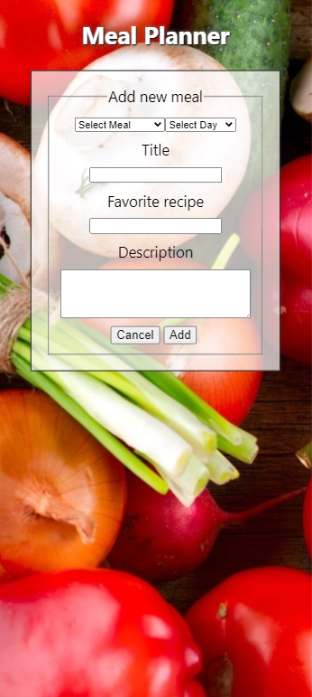
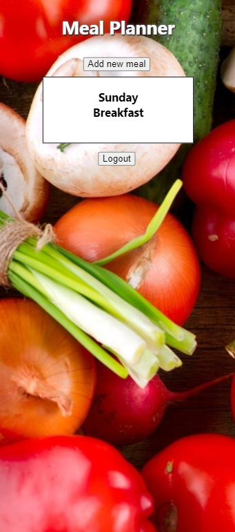
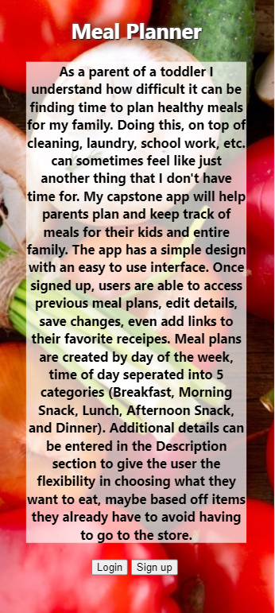

# Meal Planner 

## Summary
The app has a simple design with an easy to use interface. Once signed up, users are able to access previous meal plans, edit details, save changes, even add links to their favorite receipes. Meal plans are created by day of the week, time of day seperated into 5 categories (Breakfast, Morning Snack, Lunch, Afternoon Snack, and Dinner). Additional details can be entered in the Description section to give the user the flexibility in choosing what they want to eat, maybe based off items they already have to avoid having to go to the store.

## Test user
user: user, password:Password!123

## Link
https://meal-planner-client.vercel.app/

## Technologies
React, React Router, JavaScript, HTML, CSS

## Screenshots
</img> 
</img> 
</img> 

